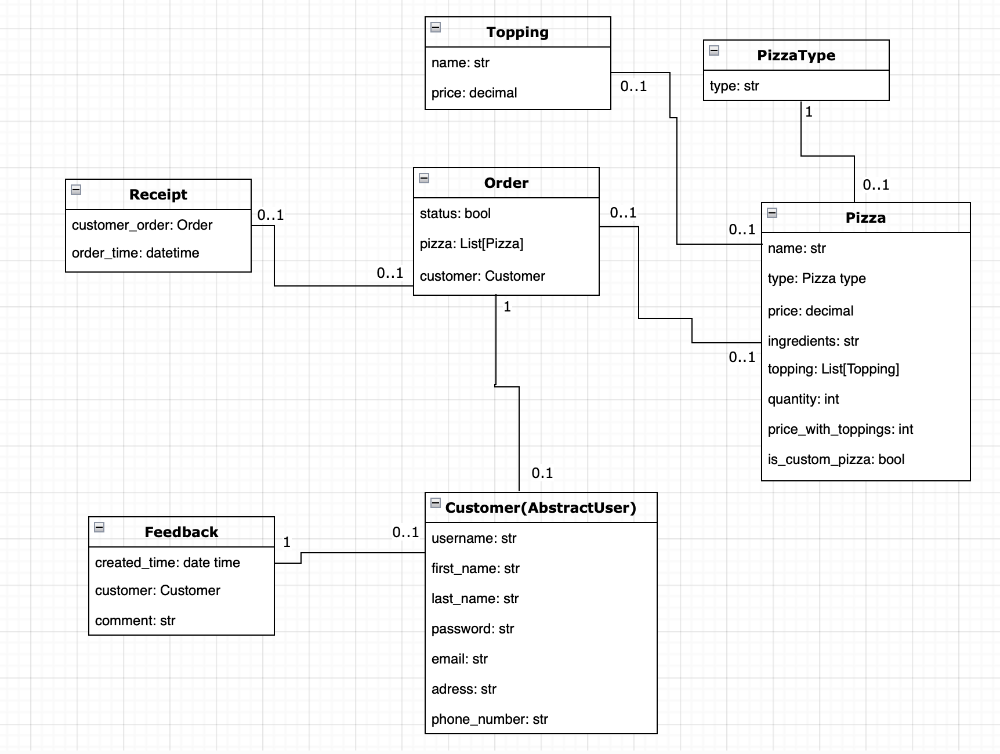

# Secure pizza delivery

## "Freshly Baked Pizzas, Delivered Safely to Your Doorstep!"

Welcome to our pizza delivery project! We offer a wide variety of delicious and freshly baked pizzas that can be delivered safely to your doorstep. Our platform provides a quick and easy ordering process, customizable toppings, fast delivery, and secure payment options.

### Features:
- Registration: You can order pizza only before registration to ensure a secure delivery process.
- Permission required: Admin, or moderator can CRUD pizza and toppings.
- Update info customer: You can update your info, if your delivery info change.
- Customer Feedback: We value your feedback and are always striving to improve our service. Leave your feedback and help us serve you better.

### Menu and Toppings List:
Our menu includes a variety of pizza options, from classic Margherita to meat lover's pizza. Our toppings list includes options like pepperoni, mushrooms, onions, bell peppers, olives, and more.

### Feedback:
We appreciate your feedback and suggestions. Please leave your comments and help us improve our service to serve you better.

Thank you for choosing our pizza delivery service. We hope you enjoy your pizza!

### Installation

```shell
git clone https://github.com/bythewaters/pizza-delivery.git
cd delivery_pizza
python3 -m venv venv 
source venv/bin/activate 
pip install -r requirements.txt
python manage.py migrate
python manage.py runserver
```

- Use the following command to load prepared data from fixture to test and debug your code:
  `python manage.py loaddata data_delivery_pizza.json`.
- After loading data from fixture you can use following superuser (or create another one by yourself):
  - Login: `Admin1849`
  - Password: `1qazcde3`
  - For create superuser, use command:
    `python manage.py createsuperuser`.
- You can also log in as a normal user and check access to functions CRUD:
  - Login: `TestUser`
  - Password: `pizzauser123`
### Db structure


